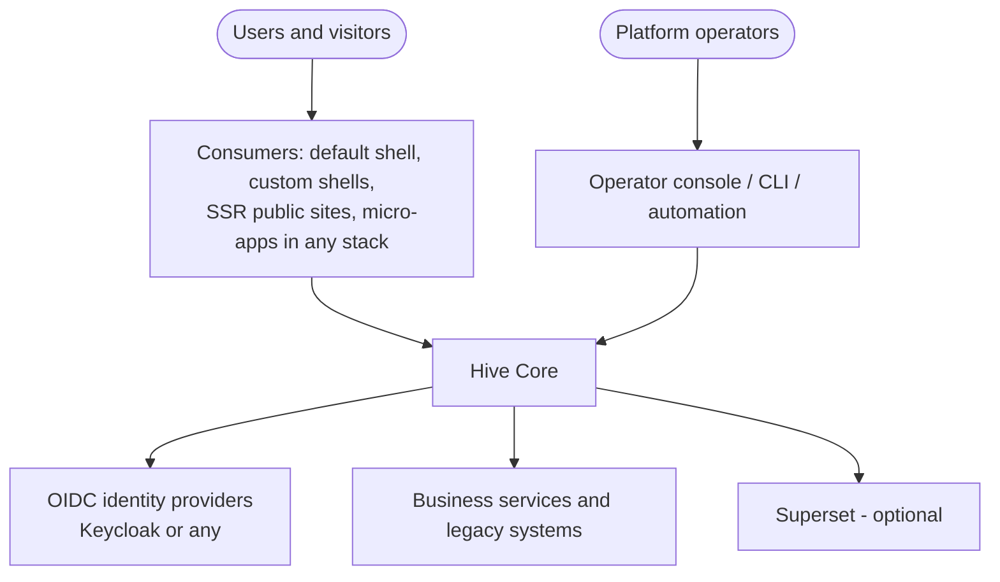
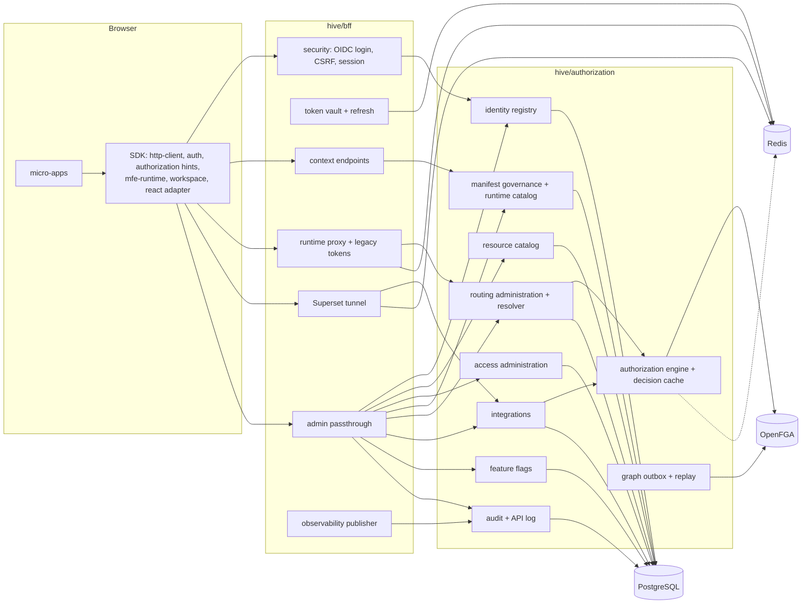
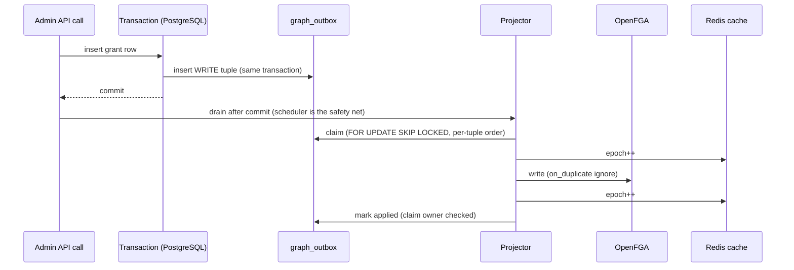
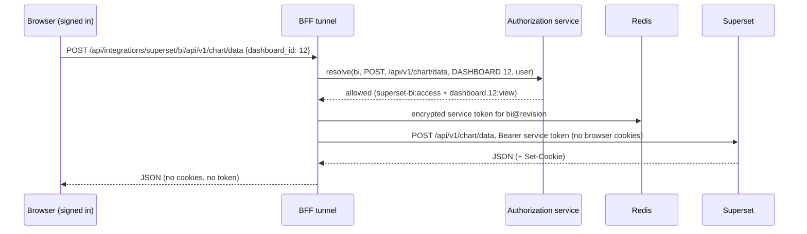

# Architecture

Hive is a headless, UI-agnostic enterprise application platform. Hive Core is two Spring Boot services — the **BFF** (browser-facing runtime) and the **authorization service** (control plane and runtime decisions) — with PostgreSQL, OpenFGA and Redis. Everything else (shells, consoles, micro-apps, business services, identity providers, Superset) is optional and replaceable.

## System context

## Containers and components

## Request flows (details in the linked documents)

| Flow | Document |
|---|---|
| Login, session, vault, refresh, logout | [identity](identity.md) |
| Authorization decision, graph projection, platform roles | [authorization](authorization.md) |
| Manifest lifecycle and coordinated activation | [manifest governance](manifest-governance.md) |
| Dynamic route execution, forward token | [dynamic routing](dynamic-routing.md) |
| Legacy token acquisition | [legacy authentication](legacy-authentication.md) |
| MFE loading sequence | [MFE runtime](mfe-runtime.md) |
| Workspace lifecycle, multi-MFE runtime | [workspace runtime](workspace-runtime.md) |
| Event bus | [event bus](event-bus.md) |
| Public / hybrid / private requests | [public, hybrid and authenticated](public-hybrid-authenticated.md) |
| Superset tunnel | [ADR-011](adr/ADR-011-superset-integration.md) |
| Deployment topology | [deployment](deployment.md) |
| Control vs runtime plane | [control plane vs runtime plane](control-plane-runtime-plane.md) |

## OpenFGA synchronization

## Superset integration

