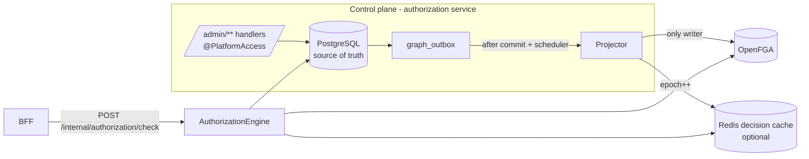
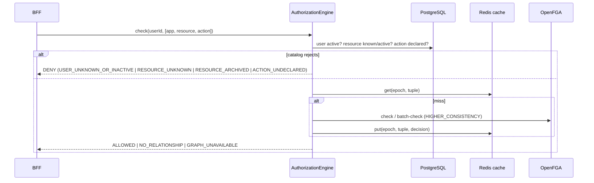

# Authorization

Implemented in `services/authorization` (packages `graph`, `access`, `admin`, `audit`). Design: [ADR-003](adr/ADR-003-authorization-source-of-truth.md).

## Decision sequence

## Graph model

| Object | Relations | Meaning |
|---|---|---|
| `group:<id>` | `member` | users in a group |
| `role:<id>` | `assignee` (users, group members) | business role membership |
| `resource:<id>` | `parent`, `manager` (inherited from parent) | catalog node and subtree administration |
| `action:<resource-id>.<key>` | `resource`, `grantee`, `allowed = grantee or manager from resource` | one declared action |
| `platform:hive` | `super_admin`, `operator`, `security_admin`, `integration_admin`, `auditor`, `reader` | control-plane roles |

Grant subjects are `user:<uuid>`, `group:<key>` or `role:<key>` in the API and are stored as UUIDs.

## Platform roles vs business roles

| | Platform roles | Business roles |
|---|---|---|
| Purpose | Operate Hive itself (control plane) | Access solution resources (runtime) |
| Examples | `SUPER_ADMIN`, `OPERATOR`, `SECURITY_ADMIN`, `INTEGRATION_ADMIN`, `AUDITOR` | Solution-defined, e.g. an examples-only `record-reader` |
| Defined by | Hive (fixed) | Solutions via `/admin/roles` |
| Stored | `platform_role_assignment` → `platform:hive` | `hive_role`, `role_assignment`, `permission_grant` |
| Conferred by grants? | Never | Yes |

A platform operator is not a business administrator: `OPERATOR` can register applications and modules but cannot grant permissions; `SECURITY_ADMIN` manages identities and grants; only `SUPER_ADMIN` assigns platform roles.

| Admin area | Read | Write |
|---|---|---|
| applications, resources (`/admin/applications/**`) | reader | operator |
| users, groups, roles, grants (`/admin/users`, `/groups`, `/roles`, `/grants`) | reader | security_admin |
| platform role assignments | reader | super_admin |
| audit (`/admin/audit`) | auditor | — |
| graph diagnostics / decision explain | reader / auditor | replay: super_admin |

## Runtime API (BFF principal only)

- `POST /internal/authorization/check` `{userId, checks:[{applicationKey, resourceKey, action}]}` → decisions with reasons (≤ 2000 checks; OpenFGA batch-check in chunks of 50).
- `GET /internal/authorization/platform-roles?userId=` → platform roles confirmed by the graph.

## Configuration

`HIVE_OPENFGA_URL`, optional `HIVE_OPENFGA_API_TOKEN`, `HIVE_OPENFGA_STORE_NAME` (default `hive`) or a pinned `HIVE_OPENFGA_STORE_ID`; `HIVE_AUTHZ_CACHE_ENABLED` with `HIVE_REDIS_HOST|PORT|PASSWORD` and `HIVE_AUTHZ_CACHE_TTL` (default 5 s); `HIVE_BOOTSTRAP_ADMIN_ISSUER`/`HIVE_BOOTSTRAP_ADMIN_SUBJECT`.

## Executed evidence (`npm run test:authorization`)

Real PostgreSQL, OpenFGA and Redis: zero-application start; first administrator bootstrap; parent-type, duplicate, unknown/cross-application parent, reserved/duplicate action, second root, cycle and stale-revision rejections; group→role→grant chain; per-action grants; `manage` inheritance down the tree and not across siblings; explicit deny reasons; cache-active revocation; revoked grants retained; archive ordering and RESOURCE_ARCHIVED; deactivation; platform-role separation (operator cannot grant, self-escalate or read audit); last super-admin protection; audit actors and correlation ids; empty outbox; recovery after the OpenFGA store is deleted.
