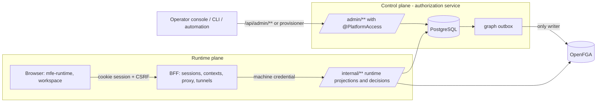

# Control plane vs runtime plane

Decision record: [ADR-002](adr/ADR-002-control-plane-runtime-plane.md).

| Concern | Control plane | Runtime plane |
|---|---|---|
| Who calls | operators (platform roles), automation | browsers via the BFF |
| Data | registrations, manifests, identities, grants, routes, integrations, flags, audit | sessions, vault, contexts, decisions, route executions |
| Changes | audited, optimistic revisions, immutable published manifests | none to configuration; API logs and audit of calls |
| Representations | admin documents (`/admin/**`) | runtime projections with revisions (`/internal/runtime/**`, resolve and check APIs) |

The runtime projections are what makes the boundary explicit: for example the BFF never reads `proxy_route`; it asks `/internal/routing/resolve` for a resolved operation including the decision, and builds contexts from `/internal/runtime/context`, whose shape is independent of the admin tables.
