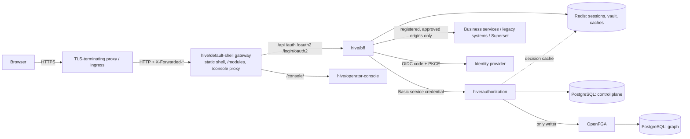

# Deployment

## Hive Core

Required: `hive/authorization`, `hive/bff`, PostgreSQL (control plane), OpenFGA with its own PostgreSQL, Redis. Optional: `hive/default-shell`, `hive/operator-console`, Keycloak or any OIDC provider, Superset, business services. Hive Core starts with zero applications, modules, users, roles, grants, routes and audit rows.

Quick start: `hive up --build --profile ui` (see [CLI](cli.md)) runs `infra/docker-compose/hive.yml` with generated local secrets. Without an identity provider the BFF serves the public runtime only; enable identity with `HIVE_IDENTITY_ENABLED=true`, `HIVE_OIDC_ISSUER`, `HIVE_OIDC_CLIENT_ID`, `HIVE_OIDC_CLIENT_SECRET` and, for the first administrator, `HIVE_BOOTSTRAP_ADMIN_SUBJECT`.

## Production profile (default)

Both services start in `HIVE_PROFILE=production` unless told otherwise and refuse to start (listing every violation, without secret values) when:

| Service | Refused setting |
|---|---|
| authorization | `HIVE_IDP_ALLOW_LOCAL_HTTP=true`; artifact or target network policy `DEVELOPMENT`; `HIVE_ARTIFACT_ALLOW_HTTP=true`; `HIVE_ARTIFACT_REQUIRE_INTEGRITY=false`; missing `HIVE_INTERNAL_PASSWORD`; database password shorter than 16 characters |
| bff | `HIVE_OIDC_ALLOW_LOCAL_HTTP=true` with identity enabled; missing `HIVE_VAULT_KEY`; non-Secure session cookie; missing `HIVE_REDIS_PASSWORD`; proxy network policy `DEVELOPMENT` |

`HIVE_PROFILE=development` downgrades these to warnings for local evaluation and tests only.

## Micro-frontend hosts

Registered MFE hosts are reached server-side only (BFF artifact gateway, `/api/mfe/**`): no reverse-proxy rule per module. Set once: `HIVE_ARTIFACT_NETWORK_POLICY` / `HIVE_ARTIFACT_ALLOWED_PRIVATE_CIDRS` / `HIVE_ARTIFACT_ALLOW_HTTP` (authorization) and `HIVE_MFE_NETWORK_POLICY` / `HIVE_MFE_ALLOWED_PRIVATE_CIDRS` / `HIVE_MFE_ALLOW_HTTP` (BFF). In the production profile plain HTTP requires `INTERNAL_ENTERPRISE`. See [MFE registration](mfe-registration.md).

## TLS and proxies

- Terminate TLS in front of the gateway and send `X-Forwarded-Proto`/`X-Forwarded-Host`. The services use `server.forward-headers-strategy=native`: forwarded headers are honored only from internal proxy addresses (Tomcat defaults: 10/8, 172.16/12, 192.168/16, 127/8, link-local), so OAuth redirect URIs and Secure cookies use the public HTTPS origin (tested).
- Add `Strict-Transport-Security` at the TLS terminator.
- The BFF→authorization channel may use HTTP only on an isolated internal network (`HIVE_CONTROL_ALLOW_HTTP=true`, as in the compose file); use HTTPS otherwise.
- OIDC issuers, provider endpoints and artifact URLs require HTTPS outside development.

## Secrets

Supply via environment or secret store, never in images or the repository: database passwords, `HIVE_INTERNAL_PASSWORD` and optional `HIVE_PROVISIONING_PASSWORD` (≥ 32 characters), `HIVE_VAULT_KEY` (Base64 256-bit; rotate with `HIVE_VAULT_KEY_ID` + `HIVE_VAULT_PREVIOUS_KEYS`), OIDC client secrets, `HIVE_IDP_*` provider secrets, `HIVE_SECRET_*` legacy/integration credentials or a read-only volume at `HIVE_SECRET_ROOT`. Disable the provisioning credential when no automation uses it.

## Operations

- Health: `/actuator/health/liveness` and `/actuator/health/readiness` (authorization readiness includes the database and the authorization graph store/model); the gateway exposes only the BFF readiness and blocks other actuator paths.
- Graceful shutdown (20 s), non-root images, JSON-file log rotation in the compose file.
- `hive doctor` checks a running installation end to end.
- Multiple instances: sessions, vault, refresh leases and legacy-token single flight are coordinated in Redis; the graph outbox uses database claims; store creation uses an advisory lock. Multi-instance load testing was not executed.
