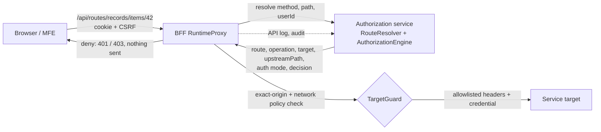
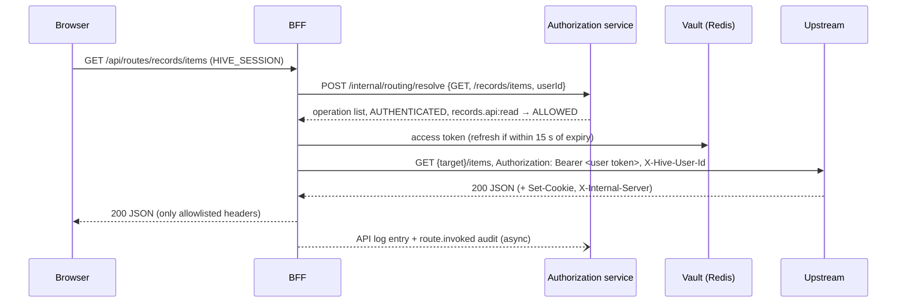

# Dynamic routing

Control plane: `services/authorization` package `routing`. Runtime: `services/bff` package `proxy`. Decisions: [ADR-007](adr/ADR-007-dynamic-routing.md).

## Admin API (`INTEGRATION_ADMIN`; API logs readable by `AUDITOR`)

| Method | Path | Body highlights |
|---|---|---|
| GET/POST/PUT | `/admin/service-targets[/{key}]` | `baseUrl`, `connectTimeoutMs` (100–30000, default 2000), `responseTimeoutMs` (100–120000, default 10000), `maxRequestBytes` (default 1 MiB), `maxResponseBytes` (default 5 MiB), `revision` |
| GET/POST/PUT | `/admin/legacy-auth-profiles[/{key}]` | see [legacy authentication](legacy-authentication.md) |
| GET/POST/PUT | `/admin/proxy-routes[/{key}]` | `applicationKey`, `moduleKey?`, `pathPrefix`, `targetKey`, `authentication` (NONE, FORWARD_TOKEN, LEGACY), `legacyProfileKey`, `upstreamBasePath`, `stripPrefix` (default true), `priority` |
| GET/POST/PUT | `/admin/proxy-routes/{key}/operations[/{op}]` | `method`, `pathPattern`, `access`, `resourceKey`+`action` (AUTHENTICATED only), `archived` |
| GET | `/admin/routing/preview?method=&path=` | resolution without a decision |
| GET | `/admin/api-logs?routeKey=&outcome=&correlationId=` | |

Upstream path = target base path + route `upstreamBasePath` + (path after the prefix when `stripPrefix`, else the full path). Example: prefix `/records`, target `http://svc/v1`, request `/api/routes/records/items/42` → `http://svc/v1/items/42`.

## Request bodies, headers and limits

RuntimeProxy forwards request bodies **opaquely, byte for byte**: the BFF never parses them (see [ADR-012](adr/ADR-012-opaque-request-bodies.md)). Supported on POST, PUT, PATCH and DELETE operations:

| Body | Example | Downstream receives |
|---|---|---|
| JSON | `application/json` | the same bytes |
| Form | `application/x-www-form-urlencoded` | the same bytes (POST and PUT/PATCH/DELETE) |
| Multipart | `multipart/form-data; boundary=…` from browser `FormData` | the same bytes and boundary: part names, filenames, part content types, text fields, multiple files, UTF-8 — parse it as usual (for example Spring `@RequestPart MultipartFile`) |
| Raw binary | `application/octet-stream`, `image/png`, … | the same bytes |

- **Size:** the target's `maxRequestBytes` (default 1 MiB) bounds every body, multipart included; larger requests get `413 REQUEST_TOO_LARGE` before the target is contacted. The BFF reads at most `maxRequestBytes + 1` bytes, so buffering is bounded. Applications enforce their own per-file business limits.
- **Headers to the target:** only `Accept`, `Accept-Language`, `Content-Type` (with the multipart boundary) and `If-*` from the browser (control characters rejected, 1024 characters max), plus Hive's `X-Correlation-Id`, `X-Hive-Route`, `X-Hive-Operation` and, for a signed-in user, `X-Hive-User-Id`/`X-Hive-Tenant-Id`. Browser cookies, browser `Authorization` and forged `X-Hive-*` headers are never forwarded.
- **Credentials:** `FORWARD_TOKEN` injects the server-held user token, `LEGACY` the cached legacy token, `NONE` nothing — identical for every body type.
- **CSRF:** every unsafe method needs the CSRF **header**; on `/api/routes/**` a `_csrf` form field is not accepted, so CSRF never reads (and consumes) a body.
- **Integrity guard:** if a declared body cannot be read in full, the request fails with `500 REQUEST_BODY_UNAVAILABLE` instead of forwarding a truncated body.

## BFF configuration

`HIVE_PROXY_ALLOWED_ORIGINS` (comma-separated exact origins; empty = no target is reachable), `HIVE_PROXY_NETWORK_POLICY` (default `UNRESTRICTED`, still blocking metadata/link-local/reserved), `HIVE_PROXY_ALLOW_HTTP`, `HIVE_PROXY_ALLOWED_PRIVATE_CIDRS`. Control plane: `HIVE_TARGET_NETWORK_POLICY`, `HIVE_TARGET_ALLOW_HTTP`, `HIVE_TARGET_ALLOWED_PRIVATE_CIDRS`.

## Error codes

`ROUTE_NOT_FOUND` 404, `ROUTE_PATH_INVALID` 400, `ROUTE_AMBIGUOUS` 409, `AUTHENTICATION_REQUIRED` 401, `ACCESS_DENIED` 403, `SESSION_EXPIRED` 401, `REQUEST_TOO_LARGE` 413, `REQUEST_BODY_UNAVAILABLE` 500, `RESPONSE_TOO_LARGE` 502, `UPSTREAM_UNREACHABLE` 502, `UPSTREAM_TIMEOUT` 504, `TARGET_NOT_APPROVED` 502, `TARGET_BLOCKED` 502, `CREDENTIAL_UNAVAILABLE` 502, `LEGACY_TOKEN_*` 502/503. All responses use the PlatformError shape with the request's correlation id.

## Executed evidence (`npm run test:routing`)

Rejected registrations (metadata IP, credentials in URL, inline secret, API_KEY mode, cross-target legacy profile, duplicate prefix, PUBLIC with permission, AUTHENTICATED without one, duplicate/overlapping patterns, regex); preview; anonymous PUBLIC with request/response header allowlists and query passthrough; anonymous AUTHENTICATED → 401 with no upstream contact; HYBRID anonymous and authenticated; unregistered path/method → 404/deny; five raw traversal/separator attacks → 400; CSRF on anonymous mutations; longest-prefix selection with NONE; response limit, timeout, request limit; redirect not followed and `Location` not relayed; unapproved origin never contacted; FORWARD_TOKEN carries the server-held user token which never appears in browser-visible responses; server-side write denial without upstream contact, then allowed after grant; LEGACY acquisition, caching, encryption at rest, single-flight under 6 concurrent misses, re-acquisition after upstream rejection and after profile change; credentials only sent to the token endpoint; logout; API log outcomes, templates and absence of query strings; audit events without tokens or credentials.

## Executed evidence for request bodies (`npm run test:multipart`, `npm run test:e2e:multipart`)

Against an ordinary Spring Boot target (`tests/fixtures/multipart-service`): one binary file with filename and MIME type; file plus text fields; multiple files; SHA-256 equality for a 1 MiB+ binary containing CR/LF and boundary-like bytes; a parseable `multipart/form-data; boundary=…` downstream; identity and Hive headers on an authenticated FORWARD_TOKEN route with no cookie or browser credential forwarded; anonymous and CSRF-less uploads rejected; LEGACY route; UTF-8 filenames and values; PUBLIC route without identity; `413` above `maxRequestBytes`; JSON, form-urlencoded (POST and PUT) and raw-binary regressions; form-body `_csrf` refused. The browser E2E signs in through Keycloak, selects files in a real `<input type="file">` and posts `FormData`; the Spring service receives the same filenames, MIME types, SHA-256 and fields.
