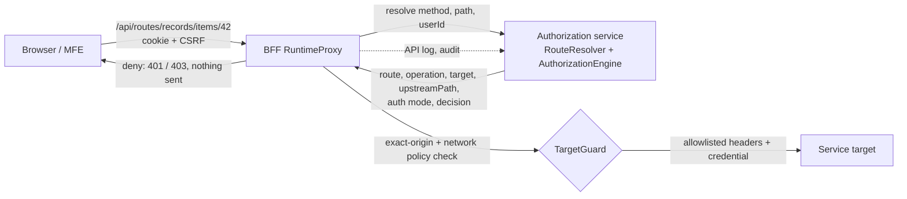
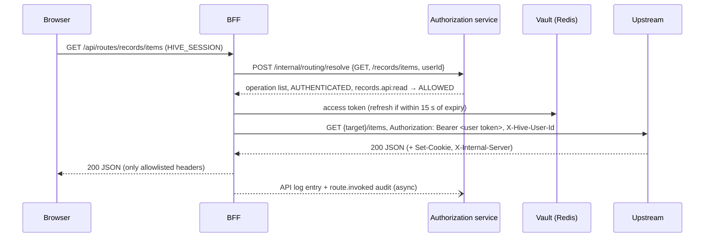

# Dynamic routing

Control plane: `services/authorization` package `routing`. Runtime: `services/bff` package `proxy`. Decisions: [ADR-007](adr/ADR-007-dynamic-routing.md).

## Admin API (`INTEGRATION_ADMIN`; API logs readable by `AUDITOR`)

| Method | Path | Body highlights |
|---|---|---|
| GET/POST/PUT | `/admin/service-targets[/{key}]` | `baseUrl`, `connectTimeoutMs` (100–30000, default 2000), `responseTimeoutMs` (100–120000, default 10000), `maxRequestBytes` (default 1 MiB), `maxResponseBytes` (default 5 MiB), `revision` |
| GET/POST/PUT | `/admin/legacy-auth-profiles[/{key}]` | see [legacy authentication](legacy-authentication.md) |
| GET/POST/PUT | `/admin/proxy-routes[/{key}]` | `applicationKey`, `moduleKey?`, `pathPrefix`, `targetKey`, `authentication` (NONE, FORWARD_TOKEN, LEGACY), `legacyProfileKey`, `upstreamBasePath`, `stripPrefix` (default true), `priority` |
| GET/POST/PUT | `/admin/proxy-routes/{key}/operations[/{op}]` | `method`, `pathPattern`, `access`, `resourceKey`+`action` (AUTHENTICATED only), `archived` |
| GET | `/admin/routing/preview?method=&path=` | resolution without a decision |
| GET | `/admin/api-logs?routeKey=&outcome=&correlationId=` | |

Upstream path = target base path + route `upstreamBasePath` + (path after the prefix when `stripPrefix`, else the full path). Example: prefix `/records`, target `http://svc/v1`, request `/api/routes/records/items/42` → `http://svc/v1/items/42`.

## BFF configuration

`HIVE_PROXY_ALLOWED_ORIGINS` (comma-separated exact origins; empty = no target is reachable), `HIVE_PROXY_NETWORK_POLICY` (default `UNRESTRICTED`, still blocking metadata/link-local/reserved), `HIVE_PROXY_ALLOW_HTTP`, `HIVE_PROXY_ALLOWED_PRIVATE_CIDRS`. Control plane: `HIVE_TARGET_NETWORK_POLICY`, `HIVE_TARGET_ALLOW_HTTP`, `HIVE_TARGET_ALLOWED_PRIVATE_CIDRS`.

## Error codes

`ROUTE_NOT_FOUND` 404, `ROUTE_PATH_INVALID` 400, `ROUTE_AMBIGUOUS` 409, `AUTHENTICATION_REQUIRED` 401, `ACCESS_DENIED` 403, `SESSION_EXPIRED` 401, `REQUEST_TOO_LARGE` 413, `RESPONSE_TOO_LARGE` 502, `UPSTREAM_UNREACHABLE` 502, `UPSTREAM_TIMEOUT` 504, `TARGET_NOT_APPROVED` 502, `TARGET_BLOCKED` 502, `CREDENTIAL_UNAVAILABLE` 502, `LEGACY_TOKEN_*` 502/503. All responses use the PlatformError shape with the request's correlation id.

## Executed evidence (`npm run test:routing`)

Rejected registrations (metadata IP, credentials in URL, inline secret, API_KEY mode, cross-target legacy profile, duplicate prefix, PUBLIC with permission, AUTHENTICATED without one, duplicate/overlapping patterns, regex); preview; anonymous PUBLIC with request/response header allowlists and query passthrough; anonymous AUTHENTICATED → 401 with no upstream contact; HYBRID anonymous and authenticated; unregistered path/method → 404/deny; five raw traversal/separator attacks → 400; CSRF on anonymous mutations; longest-prefix selection with NONE; response limit, timeout, request limit; redirect not followed and `Location` not relayed; unapproved origin never contacted; FORWARD_TOKEN carries the server-held user token which never appears in browser-visible responses; server-side write denial without upstream contact, then allowed after grant; LEGACY acquisition, caching, encryption at rest, single-flight under 6 concurrent misses, re-acquisition after upstream rejection and after profile change; credentials only sent to the token endpoint; logout; API log outcomes, templates and absence of query strings; audit events without tokens or credentials.
