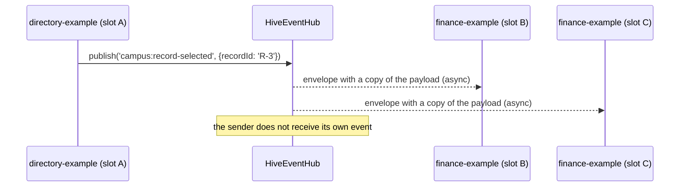

# Event bus

Micro-apps never import each other. They communicate through the `EventPort` in their mount context, backed by an explicit `HiveEventHub` created by the host (there is no hidden global hub).

- Names are namespaced: `namespace:event-name` (`[a-z][a-z0-9-]{0,39}:[a-z][a-zA-Z0-9.-]{0,79}`).
- Payloads are JSON values of at most 64 KiB, cloned per receiver (no shared mutable objects); non-serializable payloads are rejected.
- Scopes: `WORKSPACE` (default, same workspace), `APPLICATION` (same workspace and application), `GLOBAL` (every workspace attached to the same hub).
- Delivery is asynchronous (microtask) and failure-isolated: a throwing listener produces an `EVENT_LISTENER_FAILED` diagnostic and does not affect other listeners.
- Typed usage: `events.subscribe<{recordId: string}>('campus:record-selected', e => e.payload.recordId)`.
- Lifecycle: subscriptions belong to the instance; unmount releases all of them automatically (verified: zero subscriptions after closing every slot).

Evidence: event-hub and workspace unit tests; the workspace E2E delivers `campus:record-selected` from a plain-TypeScript micro-app to two instances of another micro-app in a real browser.
