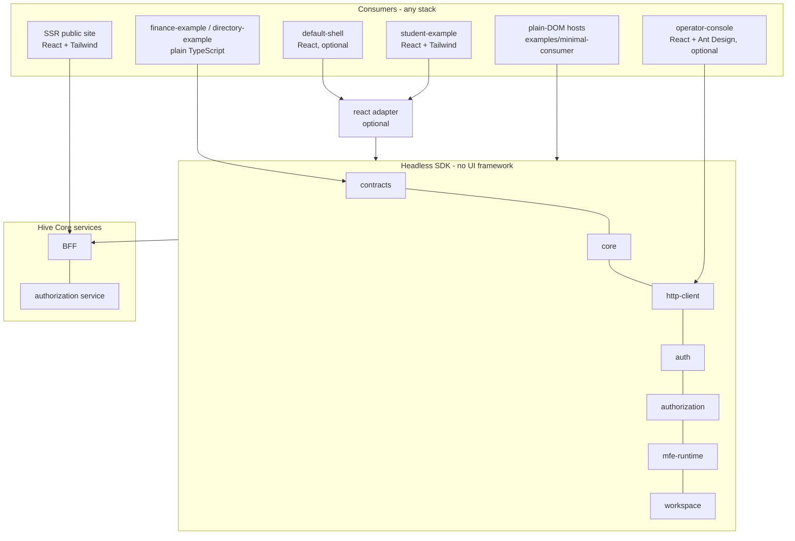

# Headless UI architecture

Platform owns capabilities. Solution owns business. Consumer owns presentation.

| Package | May depend on | Must not depend on |
|---|---|---|
| contracts, core, http-client, auth, authorization, mfe-runtime, workspace | each other (acyclic) | React, React DOM, Ant Design, MUI, Tailwind, Vue, Angular, Svelte, apps, examples |
| react | headless packages; React as peer dependency | apps, examples |
| apps/*, examples/* | anything | — (nothing in the platform depends on them) |

Enforced by `tests/architecture/boundaries.test.mjs` (import parser incl. dynamic imports and `require`, package manifests) and `tests/architecture/consumers.test.mjs`.

Hive never needs to know a consumer's component library or CSS framework: no manifest field names one. A micro-app is any ES module exporting `{contractVersion, create()}`; a host is anything that calls `MfeRuntime.mount` or `WorkspaceEngine.attach`.

## Replacing the default shell or the operator console

Both are ordinary consumers of public APIs. A replacement needs: `@hive-platform/auth` (contexts, login), `@hive-platform/workspace` or `@hive-platform/mfe-runtime` (hosting), and for administration `/api/admin/**`. The plain-DOM hosts in `examples/minimal-consumer` and the API-only administration test prove both replacements.
