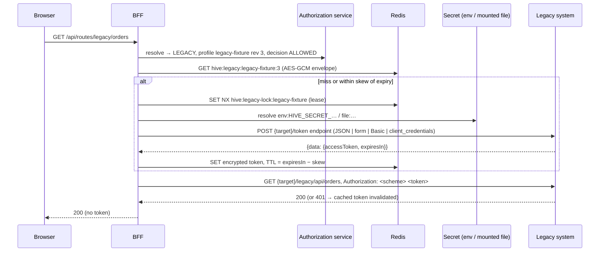

# Legacy authentication

Some upstream systems do not accept the user's OIDC token; they require a service token obtained with a technical credential. Hive acquires and caches that token in the BFF; neither the credential nor the token is ever visible to browser JavaScript, logged, audited or stored in PostgreSQL.

## Profile (`/admin/legacy-auth-profiles`)

| Field | Rule |
|---|---|
| `key` | `[a-z][a-z0-9-]{1,79}` |
| `targetKey` | the token endpoint lives on this service target; routes using the profile must use the same target |
| `tokenEndpointPath` | canonical path on the target origin |
| `requestFormat` | `JSON` (`username`, `password`, `client_id`, `client_secret`, `scope`, `audience` when present), `FORM_URLENCODED`, `HTTP_BASIC`, `OAUTH_CLIENT_CREDENTIALS` |
| `credentialReference` | `env:HIVE_SECRET_<NAME>` (JSON object in the BFF environment) or `file:<name>` (`<name>.json` below `HIVE_SECRET_ROOT`, real path must stay inside, ≤ 64 KiB). Literal secrets are rejected. |
| `tokenPointer`, `expiresInPointer`, `tokenTypePointer?` | JSON Pointers into the token response; lifetime must be 1–86400 s; token printable ASCII ≤ 16 KiB |
| `scheme` | Authorization scheme when no type pointer value is present (default `Bearer`) |
| `expirySkewSeconds` | refresh this long before expiry (0–3600, default 30) |
| `maxResponseBytes` | token response limit (256 B–1 MiB, default 64 KiB) |

Every update increments `revision`; the cache key includes it, so a configuration change forces re-acquisition. Five consecutive acquisition failures open a 30-second circuit per profile (`LEGACY_TOKEN_CIRCUIT_OPEN`). Acquisitions, failures and invalidations are audited (`legacy-token.*`) with the profile key only. The BFF requires `HIVE_VAULT_KEY` for the cache encryption (`LEGACY_VAULT_UNAVAILABLE` otherwise).

Executed evidence: the LEGACY section of `npm run test:routing`.
