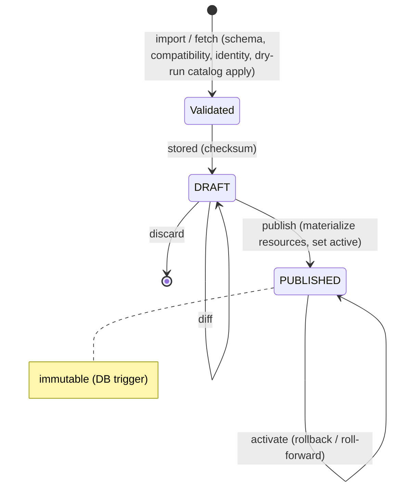

# Manifest governance

Implemented in `services/authorization` package `manifest`. Decisions: [ADR-009](adr/ADR-009-manifest-versioning.md).



```mermaid
sequenceDiagram
  participant O as Operator / CI (admin API)
  participant R as ModuleRegistry
  participant C as ResourceCatalog
  participant G as graph_outbox
  O->>R: POST artifacts (mf-manifest 3.0.0, resourceManifestVersion 2.0.0)
  O->>R: POST artifacts/3.0.0/activate
  R->>R: lock module row
  R->>C: applyModule(resources of 2.0.0) if not active
  C->>G: parent/action tuples
  R->>R: verify routes reference declared actions; no path conflicts
  R-->>O: module (activeArtifact 3.0.0, activeResources 2.0.0)
  Note over R: any failure rolls back everything
```

## Resource manifest (authorization only)

```json
{
  "schemaVersion": "1.0.0",
  "manifestVersion": "2.0.0",
  "applicationKey": "campus",
  "moduleKey": "records",
  "resources": [
    {"key": "records", "type": "MODULE", "parentKey": "campus", "name": "Records", "actions": ["view"]},
    {"key": "records.list", "type": "PAGE", "parentKey": "records", "name": "List", "actions": ["view", {"key": "print", "description": "Print"}]}
  ]
}
```

## Micro-frontend manifest (artifact and routes only)

```json
{
  "schemaVersion": "1.0.0", "manifestVersion": "3.0.0", "contractVersion": "1.1.0", "runtimeVersion": "1.0.0",
  "applicationKey": "campus", "moduleKey": "records", "displayName": "Records",
  "resourceManifestVersion": "2.0.0",
  "artifact": {"url": "/modules/records/entry.js", "integrity": "sha384-…", "format": "ES_MODULE"},
  "styleIsolation": "SCOPED",
  "routes": [
    {"key": "about", "path": "/records/about", "access": "PUBLIC", "navigation": {"label": "About", "order": 1}},
    {"key": "detail", "path": "/records/:id", "access": "AUTHENTICATED", "resource": "records.detail", "action": "view"}
  ]
}
```

Rules: `format` is `ES_MODULE`, `WEBPACK_FEDERATION` (with `remoteName` and `exposedModule`) or `VITE_FEDERATION` (with `exposedModule`) — see [MFE registration](mfe-registration.md); upstream artifact URLs reach browsers only as `/api/mfe/{module}/{version}/…`; SRI required (`HIVE_ARTIFACT_REQUIRE_INTEGRITY`); `artifact.url` is a normalized same-origin path or an absolute URL accepted by the artifact network policy (`HIVE_ARTIFACT_NETWORK_POLICY` = `PRODUCTION_INTERNET` | `INTERNAL_ENTERPRISE` | `UNRESTRICTED` | `DEVELOPMENT`, `HIVE_ARTIFACT_ALLOW_HTTP`, `HIVE_ARTIFACT_ALLOWED_PRIVATE_CIDRS`); route paths are absolute, literal or `:param` segments with optional trailing `/*`, unique within the manifest and across active modules; `PUBLIC` routes cannot require a permission; resource and action are declared together.

## API (`OPERATOR` writes, platform `reader` reads)

| Method | Path |
|---|---|
| GET/POST | `/admin/modules` (`definitionMode`: MANIFEST, MANUAL, HYBRID; optional manifest URLs) |
| GET/PUT | `/admin/modules/{module}` |
| GET/POST | `/admin/modules/{module}/resource-manifests` (POST body = manifest; 201 new, 200 idempotent) |
| POST | `/admin/modules/{module}/resource-manifests/fetch` `{url?}` |
| GET/DELETE | `/admin/modules/{module}/resource-manifests/{version}` (DELETE drafts only) |
| GET | `/admin/modules/{module}/resource-manifests/{version}/diff` |
| POST | `/admin/modules/{module}/resource-manifests/{version}/publish` · `/activate` |
| GET/POST | `/admin/modules/{module}/artifacts`, `/artifacts/fetch` |
| POST | `/admin/modules/{module}/artifacts/{version}/activate`, `/admin/modules/{module}/deactivate` |
| GET | `/admin/modules/{module}/releases` |
| GET/PUT | `/admin/modules/{module}/navigation[/{routeKey}]` (overlay `{label, order, hidden, revision}`) |
| POST | `/admin/manifests/validate` `{kind: RESOURCE \| MICRO_FRONTEND, document}` |
| GET | `/admin/runtime/catalog` and (BFF only) `/internal/runtime/catalog` |

## Executed evidence (`npm run test:manifests`)

Invalid schema, frontend fields, unsupported schema major, duplicates, invalid parent, cycle and identity mismatch are rejected without drafts or catalog changes; draft, idempotent re-import, immutable version, diff (added/renamed/action added/action archived/archived), publish, double-publish and published-discard refusals, database-level immutability, second version from a registered URL, history, rollback restoring archived resources and actions together with surviving grants, authorization after each version change, ownership conflicts between modules, MANIFEST/HYBRID/MANUAL modes, six classified fetch failures, artifact immutability, incompatible contract/runtime and missing SRI rejections, deprecation warnings, coordinated activation, undeclared-route and unpublished-revision refusals with full rollback, cross-module route conflicts, overlays not affecting authorization, ordered release history, audit and runtime-plane access control.
