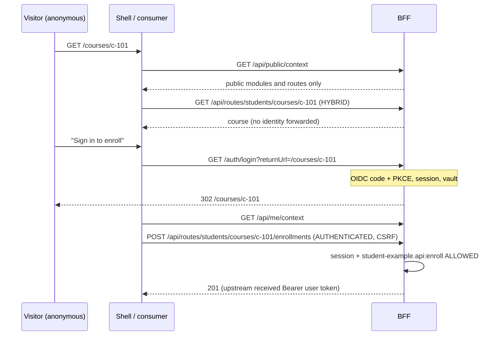

# Public, hybrid and authenticated runtime

Hive serves anonymous visitors and signed-in users from the same deployment. UI access and API access are declared separately and enforced separately.

| Mode | UI route (micro-frontend manifest) | API operation (route operation) |
|---|---|---|
| `PUBLIC` | rendered for everyone; cannot require a permission | anonymous allowed; no credential is forwarded for anonymous callers |
| `HYBRID` | rendered for everyone; the micro-app adds capabilities when `context.authenticated` | anonymous allowed; for sessions the user token (or legacy token) and `X-Hive-User-Id` are forwarded so the backend can personalize |
| `AUTHENTICATED` | requires a session; a declared resource action is checked (UI hint) | requires a session **and** the declared resource action, checked server-side before any upstream contact |

A public UI route never makes its backend public: every operation declares its own access (an anonymous page can still call `AUTHENTICATED` operations, which answer 401).

## Contexts

- `GET /api/public/context` (anonymous-safe): branding, locale, direction, applications with public modules, public and hybrid routes with navigation, `PUBLIC` feature flags. Never: identity, session, permissions, platform roles, protected routes, resource keys of protected routes, targets, origins, credentials, `AUTHENTICATED`/`INTERNAL` flags.
- `GET /api/me/context` (session): token-free identity, session expiry, permissions (`applicationKey:resourceKey` → actions), platform roles, all routes of applications the user is a member of, `PUBLIC` and `AUTHENTICATED` flags. `Cache-Control: no-store`.
- Hosts treat an unknown path as "sign in to continue" for anonymous visitors (protected routes are not disclosed) and "not found" for signed-in users.

## Login return URL

`/auth/login?returnUrl=/path` returns to the original local path after login. Absolute, protocol-relative, backslash, traversal, control-character, encoded-separator and auth-loop values are rejected (server: `ReturnUrl`; client mirror: `isSafeReturnUrl` in `@hive-platform/auth`).

## SEO-compatible public consumers

Public pages do not have to be client-side micro-apps. `examples/react-tailwind-consumer/public-web` renders a news page on the server with React and Tailwind from `/api/public/context` and a `PUBLIC` route operation, sets no cookies, and links into the portal with a safe login return URL. Any SSR framework (Next.js, Nuxt, Astro, plain Node) follows the same pattern.

## Executed evidence

`npm run test:e2e:public-hybrid` (Edge): anonymous navigation shows only public/hybrid routes; Tailwind-styled micro-app with no Tailwind in the host document; public context contains no identity, permissions, protected routes, targets, origins or non-public flags; public API works anonymously; HYBRID page anonymous without forwarded identity; AUTHENTICATED API 401 and UI sign-in prompt; login from the HYBRID page returns to it; personalized HYBRID data and successful enrollment with the forwarded user token; full navigation, permission-gated extension and authenticated flags after login; a signed-in user without the permission sees no action and gets 403 from the API; logout returns protected slots to sign-in; the SSR site renders public data with Tailwind and without cookies.
