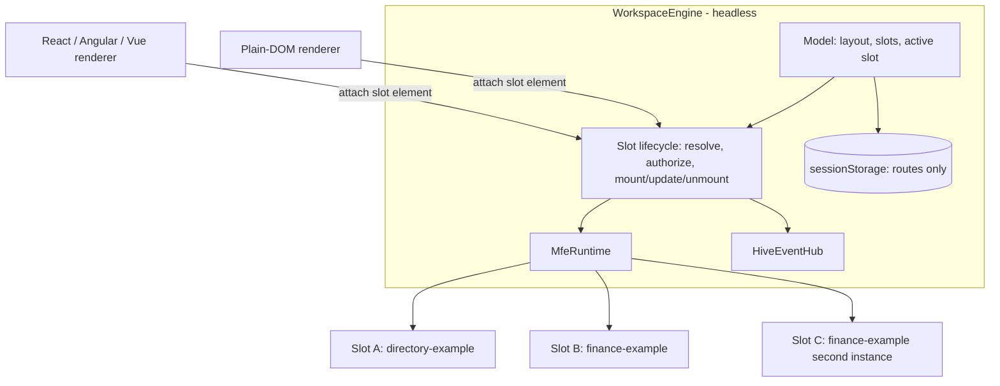
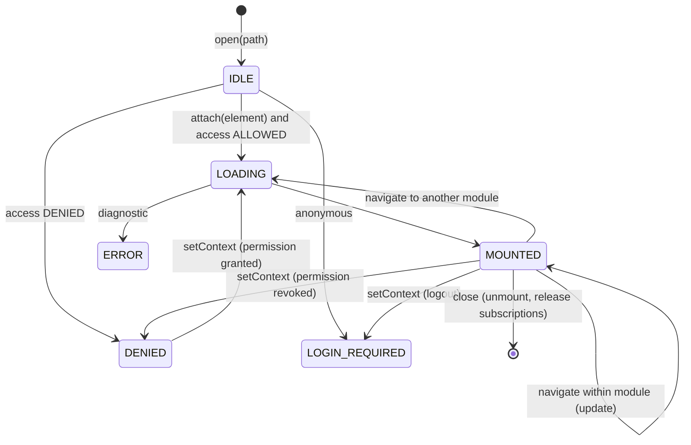

# Workspace runtime

`@hive-platform/workspace` hosts several micro-apps at once without depending on a shell or UI framework. Decisions: [ADR-005](adr/ADR-005-workspace-runtime.md), [ADR-006](adr/ADR-006-workspace-persistence.md). Inter-app messaging: [event bus](event-bus.md).





## Usage

```ts
const engine = new WorkspaceEngine({runtime: new MfeRuntime(), context, persistence: sessionPersistence('my-app.workspace')});
if (!engine.restore()) { await engine.setLayout('SPLIT'); engine.open('/directory'); engine.open('/finance'); }
renderDomWorkspace(engine, document.getElementById('workspace')!);   // or attach(slotId, element) from your own renderer
engine.state.subscribe(workspace => console.log(workspace.slots));
await engine.setContext(await auth.currentContext());                // after login, logout or permission changes
```

## CSS isolation

| Mechanism | Guarantee |
|---|---|
| `styleIsolation: SHADOW_DOM` in the micro-frontend manifest | the instance renders inside an open shadow root; its styles cannot leak out and host styles do not leak in (except inherited properties) |
| `styleIsolation: SCOPED` (default) | the instance gets `div.hive-mfe-root[data-hive-module][data-hive-instance]`; micro-apps must prefix every selector (e.g. `.hx-directory ...`) and must not ship global resets |
| Tailwind | disable Preflight (global reset) or scope it to the module root; never let a micro-app's Tailwind build reset the host. See [React + Tailwind guide](react-tailwind-guide.md) |
| Portals and overlays | render popups inside the instance container (or its shadow root), never into `document.body`, so they unmount with the instance |
| z-index | hosts reserve values of 1000 and above for their chrome; micro-apps stay below 1000 within their container |

Tailwind-specific guidance is documentation only; no Tailwind dependency exists in any Hive package. The workspace E2E mounts a SHADOW_DOM module next to a SCOPED module.

## Executed evidence

Unit (`tests/packages/workspace.test.mjs`): split mount, cross-module events without echo, two instances of one module, failure isolation, update vs remount, subscription cleanup; per-slot authorization across context changes; layout capacity, SINGLE replacement, persistence shape and restore fidelity, hostile state sanitizing; event scopes, payload copies, listener isolation, validation; renderer element stability.

Browser (`tests/e2e/workspace.test.mjs`, Edge): SPLIT with two different micro-apps; event from one micro-app triggers the other's backend call through a Hive route with the server-held user token; DASHBOARD with three instances of the same module receiving the same event; unknown route isolated as ERROR; server-side grant revocation followed by context refresh shows DENIED for that slot only, and the grant's return remounts it; TABS keeps all instances mounted while hiding inactive ones; reload restores layout, slots, routes, active slot and instance ids; persisted text contains no identity or token; SINGLE keeps the active slot; logout turns protected slots into LOGIN_REQUIRED while a public slot stays mounted and the session is invalid.
